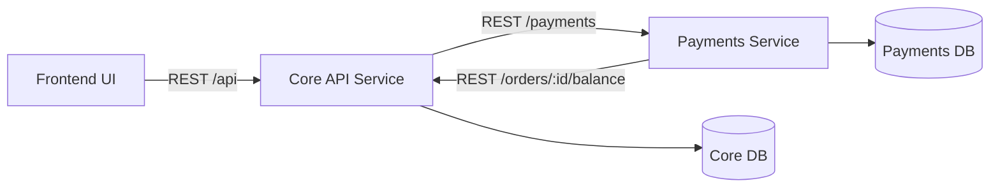

# Tailor Shop Management System

## 1) Problem Identification and Brief Description

- **Problem**: Small tailor shops struggle to track customers, measurements, orders, and payments across multiple staff members.
- **Why this problem**: It is common, clear, and has simple business logic that fits a component-based approach.
- **Proposed solution**: A modular system with a core API, a dedicated payments service, and a frontend UI.
- **Goal**: Improve operational visibility and reduce manual tracking errors while keeping services decoupled.

## 2) Unsophisticated Implementation (Component-Based)

- **Subsystem A: Core API** (orders, customers, measurements, users, analytics)
- **Subsystem B: Payments Service** (payment history + balance updates)
- **Subsystem C: Frontend UI** (owner/tailor dashboards)

Each subsystem is independently executable and communicates via REST interfaces.

## 3) System Modeling (UML Component Diagram)

## 4) Implementation Highlights

- **Independent execution**:
  - Core API: [backend/src/server.js](backend/src/server.js)
  - Payments Service: [payments-service/src/server.js](payments-service/src/server.js)
  - Frontend UI: [frontend/src/router.tsx](frontend/src/router.tsx)
- **Simple UI per subsystem**:
  - UI routes for Orders/Payments in [frontend/src/routes](frontend/src/routes)
  - Payments service exposes `/payments` endpoints (service-only) in [payments-service/src/modules/payments](payments-service/src/modules/payments)
- **Inter-component interfaces**:
  - Core API calls Payments Service via REST proxy in [backend/src/modules/payments/payments.controller.js](backend/src/modules/payments/payments.controller.js)
  - Payments Service calls Core API balance endpoints via adapter in [payments-service/src/services/orderClient.js](payments-service/src/services/orderClient.js)

## 5) Design Patterns (7 Implemented)

- **Strategy**: encapsulated payment type calculation using a polymorphic interface extending an abstract base class in [payments-service/src/services/paymentStrategies.js](payments-service/src/services/paymentStrategies.js) (satisfies **OO Abstraction** principle).
- **Factory**: dynamic instantiation of concrete payment strategies inside `paymentStrategyFactory` in [payments-service/src/services/paymentStrategies.js](payments-service/src/services/paymentStrategies.js).
- **Observer (Event-Driven)**: 
  - Payment events listener triggering ledger logs in [payments-service/src/events/paymentEvents.js](payments-service/src/events/paymentEvents.js).
  - Order status change triggers custom listeners to notify customers in [backend/src/events/orderEvents.js](backend/src/events/orderEvents.js) and [backend/src/observers/orderObserver.js](backend/src/observers/orderObserver.js).
- **Adapter**: 
  - Core API balance endpoint adapter in [payments-service/src/services/orderClient.js](payments-service/src/services/orderClient.js).
  - Pluggable customer notifications wrapping Resend Email and console SMS interfaces in [backend/src/services/notificationAdapter.js](backend/src/services/notificationAdapter.js).
- **Singleton**: DB connection pooling and promise caching in [payments-service/src/config/db.js](payments-service/src/config/db.js) and [backend/src/config/db.js](backend/src/config/db.js).
- **Facade**: high-level Client interface to simplify microservice REST calls inside [backend/src/services/paymentsClient.js](backend/src/services/paymentsClient.js).
- **Chain of Responsibility**: Express sequential middleware pipelines (`protect`, `restrictTo`, `serviceAuth`, global error handler) inside routing structures in both services.

## 6) How to Run (3 Subsystems)

1. **Core API**
   - `cd backend`
   - `npm install`
   - `npm run dev`

2. **Payments Service**
   - `cd payments-service`
   - `npm install`
   - `npm run dev`

3. **Frontend UI**
   - `cd frontend`
   - `bun install` (or `npm install` if you prefer)
   - `bun run dev`

## 7) Required Environment Variables (Summary)

- Core API
  - `PAYMENTS_SERVICE_URL=http://localhost:5001`
  - `SERVICE_TOKEN=change-me`
- Payments Service
  - `CORE_API_BASE_URL=http://localhost:5000/api`
  - `SERVICE_TOKEN=change-me`

## 8) Team Contributions

- Add member names and ownership of each subsystem and design patterns here.
